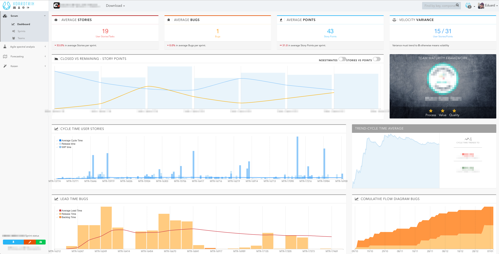
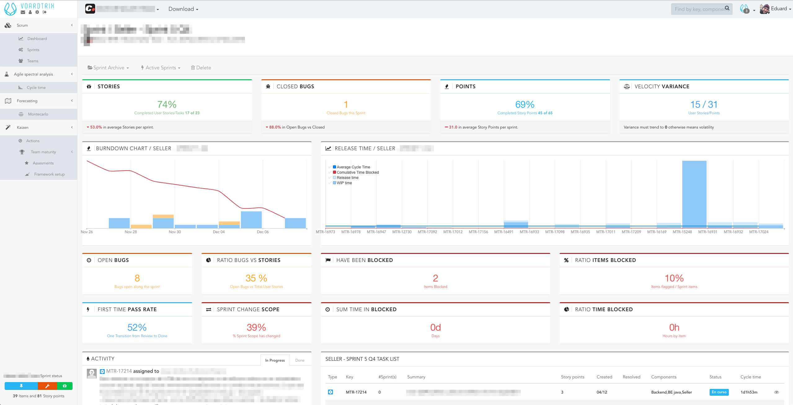
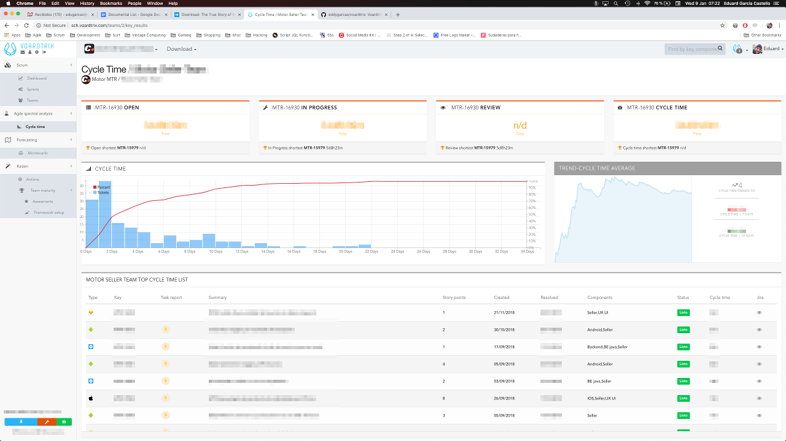

# Vortrics

Vortrics was conceived from the idea to have a customized Scrum Dashboards as well as a system to analyze every team sprints and propose improvements based on expertise.

Currently I use this app for my own experimentation, creating any kind of graphics that helps me on my daily work and also to coach teams and managment based on real data.

## Getting Started

These instructions will get you a copy of the project up and running on your local machine for development and testing purposes. See deployment for notes on how to deploy the project on a live system.

### Prerequisites

Scrum Agent feeds from JIRA through its REST API, to do that ask your system administrator to grant you access to JIRA REST API first.

Out client will authenticate against JIRA REST API using OAuth, this way will avoid sending any sensitive data, username and password basically. 'jira-ruby' main page has a complete guide about how to generate all public keys, will need them to connect to JIRA using OAuth (https://github.com/sumoheavy/jira-ruby)

Generate a consumer key
```ruby
$ rake jira:generate_consumer_key
You can use this as your consumer key: secretum0elementum
```
Consumer key is required setting up an application link in JIRA.

Generate a public certification
```ruby
$ rake jira:generate_public_cert
Executing 'openssl req -x509 -nodes -newkey rsa:1024 -sha1 -keyout rsakey.pem -out rsacert.pem'
Generating a 1024 bit RSA private key
.........++++++
........++++++
writing new private key to 'rsakey.pem'
-----
Done. The RSA-SHA1 private keyfile is in the current directory: 'rsakey.pem'.
You will need to copy the following certificate into your application link configuration in Jira:
-----BEGIN CERTIFICATE-----
munus=publicum
-----END CERTIFICATE-----
```
Place both files in root directory
```ruby
rsacert.pem
rsakey.pem
```

Check out the following link to know how to set up an application link in JIRA. (https://support.desk.com/customer/portal/articles/1428875-jira-6-x-installation---onpremise-or-ondemand)

*config.yml* file has a set of properties that handles OAuth as well as JIRA connection. Among other properties *consumerkey* has to be updated with the one generated by *rake:generate_consumer_key* process.
Make sure setting *site* property as well, pointing to JIRA site.
```ruby
:jira:
  :site: "https://"
  :restbasepath: "/rest/api/2"
  :contextpath: ""
  :httpdebug: true
  :signaturemethod: "RSA-SHA1"
  :privatekeyfile: "rsakey.pem"
  :consumerkey: ""
  :fields: key,priority,issuetype,status,componentes,customfield_11382,summary,customfield_11802,timeoriginalestimate,components,description,assignee,created,updated,resolutiondate
```
### Gemfile

Rapid Rails Themes is a propietary software so you will need to get a licence to make it work.
```ruby
source "https://gems.rapidrailsthemes.com/gems" do
  gem "dresssed-ives", "~> 1.0.66"
end
```

Jira Ruby provide full integration with JIRA Rest API, it's the easier way to run queries or use predefined method to get information of your projects in jira.
```ruby
gem 'jira-ruby', :require => 'jira-ruby'
```


## Deployment

### Heroku deployment

```console
$ heroku login
This is the legacy Heroku CLI. Please install the new CLI from https://cli.heroku.com
heroku: Enter your login credentials
Email [xxxxxxxxx@xxxxx.com]: xxxxxxxxx@xxxxx.com
Password: *************
Logged in as xxxxxxxxx@xxxxx.com

$ heroku create your-app
This is the legacy Heroku CLI. Please install the new CLI from https://cli.heroku.com
Creating ⬢ your-app... done
https://your-app.herokuapp.com/ | https://git.heroku.com/your-app.git

$ git remote -v
heroku  https://git.heroku.com/your-app.git (fetch)
heroku  https://git.heroku.com/your-app.git (push)
origin  https://Eddygarcas@bitbucket.org/Eddygarcas/scrummetrics.git (fetch)
origin  https://Eddygarcas@bitbucket.org/Eddygarcas/scrummetrics.git (push)
```

Before pushing all changes into Heroku will have to set up and environment variable with RapidRails credentials
```console
$heroku config:set BUNDLE_GEMS__RAPIDRAILSTHEMES__COM=xxxxxxxx@xxxx.com:xxxxxXXxxxXXx
This is the legacy Heroku CLI. Please install the new CLI from https://cli.heroku.com
Setting BUNDLE_GEMS__RAPIDRAILSTHEMES__COM and restarting ⬢ your-app... done, v3
BUNDLE_GEMS__RAPIDRAILSTHEMES__COM: xxxxxxxx@xxxx.com:xxxxxXXxxxXXx
```

Next command should be pushing all changes into Heroku, which will trigger a deployment.
```console
$ git push heroku master
remote: -----> Launching...
remote:        Released v14
remote:        https://your-app-sch.herokuapp.com/ deployed to Heroku
remote: 
remote: Verifying deploy... done.
To https://git.heroku.com/scrum-age
```
Once has been deployment, open a Heroku console and run Rails database migration command
```console
~/db/migrate $ cd ..
~/db $ cd ..
~ $ rails db:migrate
```

## Built With

* [Rapid Rails Themes](https://rapidrailsthemes.com/) - RubyGem which integrates with your Rails project to provide over a dozen themes, components pre-coded into view partials, page generators, scaffolding inegration and Devise support.
* [Ruby on Rails](https://rubyonrails.org/) - Web framework


## Authors

**Eduard Garcia Castelló** - *Bio* - [Linkedin](https://www.linkedin.com/in/eduard-garcia-castello/) - [Twitter](https://twitter.com/egarciacastello)

## License

This project is licensed under the GNU GENERAL PUBLIC LICENSE License - see the [LICENSE.md](LICENSE.md) file for details

## Screenshots
#### Historical data analysis

#### Sprint Metrics

#### Cycle Time analysis


